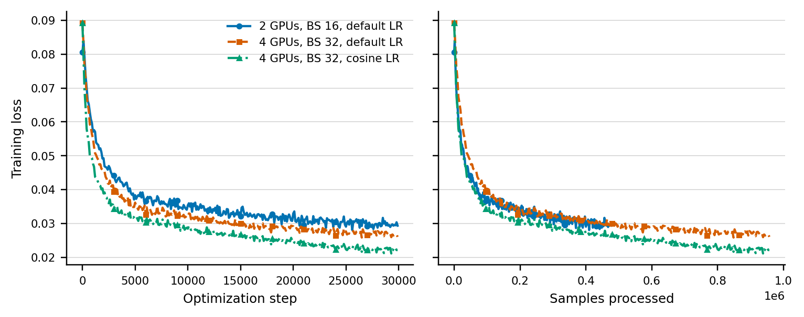

# ACPD 蒸馏实验组会报告

## 1. 训练环境与 SFT 基线

### 1.1 计算资源与 Batch Size

以下均为 pi0.5 LoRA 的实测配置。BS 表示全局 batch size。

| 训练类型 | 最少可运行 GPU | 4 卡无梯度累积的已验证 BS | 实测依据 |
|---|---:|---:|---|
| SFT | 1 | 32 | LoRA 单卡可运行；4 卡 BS32 已稳定完成 60K steps。 |
| ACPD 蒸馏 | 2 | 32 | 2 卡 BS32 已完成多组 2K/5K 实验；4 卡 BS32 已通过训练测试。 |

实测训练时间：SFT 4 卡 BS32 训练 30K 约 16 小时；ACPD 蒸馏 2 卡 BS32 训练 5K 约 4.5 至 9 小时。

### 1.2 SFT 训练 Loss 对比

左图按优化步数比较，右图按已处理样本数比较。4 卡 BS32 使用 cosine 学习率时收敛更快，30K loss 为 0.0222，低于相同 BS 的默认学习率 0.0261；按样本数对齐后仍保持最低，说明差异不只是每步处理样本更多。训练 loss 只反映优化过程，模型效果仍以任务成功率为准。

### 1.3 SFT 训练步数对比

基于 1.2 的训练结果，后续 SFT 统一采用 cosine 学习率设置。

共同设置：4 卡 FSDP LoRA、global BS32、cosine 学习率。每个 checkpoint 在四套 LIBERO benchmark 上共验证 2,000 episodes。

| Checkpoint | 平均成功率 |
|---:|---:|
| 30K | 46.20% |
| 40K | 49.20% |
| **50K** | **57.05%** |
| 60K | 54.25% |

结论：BS32 已能稳定支持 SFT 和蒸馏实验。SFT 在 50K 达到最高成功率，继续训练到 60K 没有带来提升。

## 2. 原始 ACPD 诊断

### 2.1 用训练 Loss 初步比较 ACPD 设置

SFT 对照中，cosine 学习率同时取得了更低的训练 loss 和更高的任务成功率，说明训练 loss 可以在一定程度上反映模型效果。因此，在进行完整仿真验证前，先用训练 loss 低成本比较不同 ACPD 层和损失组件。

| 比较目的 | 实验 | Loss 结果 |
|---|---|---|
| 是否需要 layer 6+12 | 比较 layer 6、12、6+12，训练 5K | layer 6 loss 最低，但差异均小于 1%。 |
| Cue 或 ACL 是否加快收敛 | 比较 Flow、Cue、ACL、Full，训练 2K | 相对 Flow 的 loss 差异均小于 1%。 |

结论：训练 loss 可以用于初步筛选，但这两组 ACPD 实验的差异均小于 1%，没有形成像 SFT 那样清晰的区分。双层 ACPD 没有表现出优势，Cue 和 ACL 的效果需要通过任务成功率进一步判断。

### 2.2 成功率提升来自哪个组件

共同设置：backview student、BS32、5K、四套 LIBERO 共 2,000 episodes。

| 方法 | 平均成功率 | 结论 |
|---|---:|---|
| Flow-only | 4.45% | 基线 |
| ACL-only | 6.35% | 比 Flow-only 高 1.90 个百分点；差值的 95% 置信区间为 `[+0.75, +3.10]` 个百分点，整个区间大于 0，说明 ACL 的提升可信。 |
| Full ACPD | 6.50% | 比 ACL-only 高 0.15 个百分点；差值的 95% 置信区间为 `[-1.15, +1.40]` 个百分点，区间跨过 0，不能证明原 Cue 带来额外提升。 |

<small>备注：两个方法在相同的 2,000 个 episode 上验证。统计时，从每个任务的 50 组配对结果中重复抽样 10,000 次，每次重新计算成功率差。ACL-only 实际比 Flow-only 多成功 38 次；重新抽样后仍会多成功约 15 至 62 次，因此区间始终大于 0。Full ACPD 实际只比 ACL-only 多成功 3 次；重新抽样后可能少成功 23 次，也可能多成功 28 次，因此区间跨过 0，无法确定谁更好。该区间只反映验证初始状态的随机性，不包括训练 seed 的变化。</small>

结论：Full ACPD 优于 Flow-only，但提升主要由 ACL 解释。

## 3. ACPD-v2 模型与训练目标

ACPD-v2 的目标是让只观察 backview 的 student 恢复 teacher 从 agentview 和 wrist 获得的动作相关信息，并利用这些信息生成动作。

### 3.1 Teacher 与 Student

| 模型 | 输入视角 | 训练状态 | 作用 |
|---|---|---|---|
| Teacher pi0.5 | agentview + wrist | 冻结 | 提供动作预测和特权视觉贡献。 |
| Student pi0.5 | backview | LoRA 训练 | 生成动作并预测缺失视角的贡献。 |

两者接收相同的语言、机器人状态、带噪动作和 flow time。Student 的 PaliGemma 使用 rank 16 LoRA，action expert 使用 rank 32 LoRA；额外训练线性贡献预测器和一个标量 gate。

### 3.2 Teacher 提供什么监督

pi0.5 的 action expert 使用 action token 从图像、语言和动作 token 中读取信息。ACPD-v2 在候选 action-expert 层中，将 attention 输出按图像来源拆成 agentview 和 wrist 两部分。

每一部分都保留原模型的 attention 权重、value、输出投影和 AdaRMS gate。因此，提取结果不是 attention 分数，而是该视角在 teacher 前向计算中实际加入 action token 的信息向量。Teacher 参数冻结，这两个向量就是 student 的固定监督目标。

### 3.3 Student 如何学习和使用

Student 从同一 action-expert 层的 action hidden state 出发，通过线性 predictor 分别预测 agentview 和 wrist 的贡献。两个视角分别计算归一化 MSE，避免某个视角仅因向量幅值较大而主导训练。

预测出的两个贡献相加后，通过从 0 初始化的标量 gate 加入 student 最终的 action representation。Policy loss 只决定是否以及多大程度使用这项信息，不反向改变 predictor 的目标。推理时移除 teacher，student 只依赖 backview、贡献预测器和 gate。

### 3.4 训练损失

| 损失 | 权重 | 作用 |
|---|---:|---|
| Flow matching | 1.0 | 保持 pi0.5 原有的动作生成目标。 |
| Contribution | 0.2 | 让 student 分别恢复 agentview 和 wrist 的视觉贡献。 |
| ACL | 0.5 | 对齐 teacher 与 student 在 action horizon 和 7 个动作维度上的动作流方向。 |

总损失是以上三项的加权和。

## 4. 蒸馏层选择

### 4.1 实验设计

固定 teacher 和 Flow-only student，在 episode 级 held-out 数据上测试 layer 6--12。每层、每个 teacher 视角训练独立线性 probe，将 student 的 action hidden state 映射为 teacher 的视觉贡献。每个 probe 使用 3 个初始化 seed、500 steps；验证集包含 256 个样本。

该实验只回答“student 是否能从 backview 恢复该层的特权贡献”，不训练 policy，也不测任务成功率。

### 4.2 指标计算

为排除共享动作和时间输入形成的捷径，将目标视角的图像信息在 batch 内错配，同时保持 action query、带噪动作、flow time 和其他输入不变，重新计算 teacher contribution。

| 指标 | 计算 | 含义 |
|---|---|---|
| Correct cosine | 预测向量与当前样本正确贡献的 cosine | 预测与正确 teacher contribution 的方向一致性。 |
| Shuffled cosine | 预测向量与错配视角贡献的 cosine | 预测与错误视角 contribution 的方向一致性。 |
| Cosine gap | Correct cosine 减去 Shuffled cosine | gap 越大，预测越能恢复当前样本的特权视觉贡献，而不是只复现共享动作输入。 |
| Explained variance | 与始终预测验证集均值的基线比较 | 大于 0 才说明恢复了样本差异。 |
| Hard gap | teacher 相对 student 的 flow error 优势最大的 25% 样本上的 cosine gap | 检查困难样本上的可恢复性。 |

Cosine gap 和 hard gap 的 95% CI 通过 episode bootstrap 计算。可用层需同时满足：overall gap 至少为 0.10、hard gap 至少为 0.05、两者 CI 下界大于 0、explained variance 大于 0。最佳层还需比次优层高至少 0.02。

### 4.3 层扫描结果

| Layer | Overall gap | Hard gap | Explained variance | 结论 |
|---:|---:|---:|---:|---|
| 6 | 0.0997 | 0.0706 | -0.1468 | 不可用 |
| 7 | 0.3261 | 0.2776 | 0.2833 | 通过 |
| 8 | 0.2858 | 0.2373 | 0.3420 | 通过 |
| 9 | 0.3417 | 0.3194 | 0.2822 | 通过 |
| **10** | **0.3992** | **0.3779** | **0.3556** | **选中** |
| 11 | 0.3508 | 0.3045 | 0.3113 | 通过 |
| 12 | 0.2367 | 0.2080 | 0.0903 | 通过 |

Layer 10 的 overall gap 比次优 layer 11 高 0.0485，超过预设的 0.02 门槛；其 hard gap 和 explained variance 也为所有候选层最高。因此，后续 policy 实验使用 layer 10。

## 5. 阶段性结论

1. 5090 已能稳定完成 pi0.5 LoRA SFT 和 ACPD 蒸馏，BS32 足够使用。
2. cosine SFT 的最佳 checkpoint 是 50K，平均成功率为 57.05%。
3. 原始 ACPD 的 5K 提升主要来自 ACL。
4. layer 10 的特权 attention contribution 最容易恢复。
